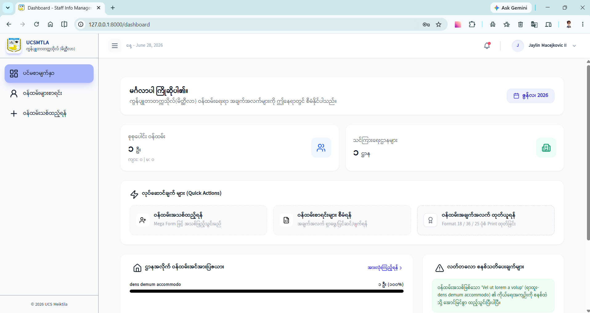
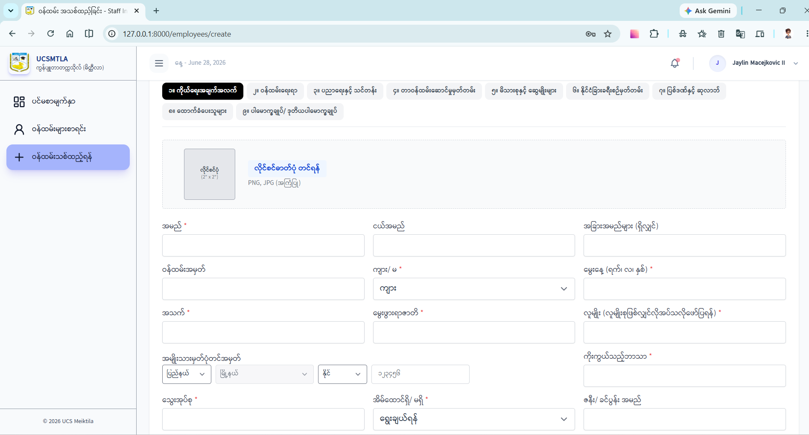
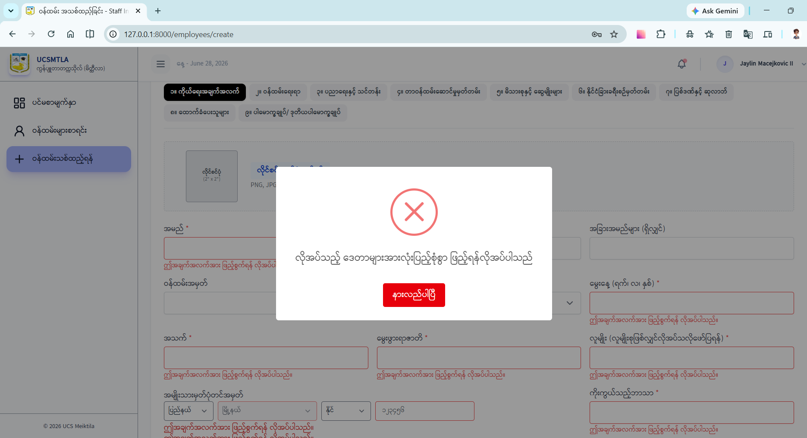
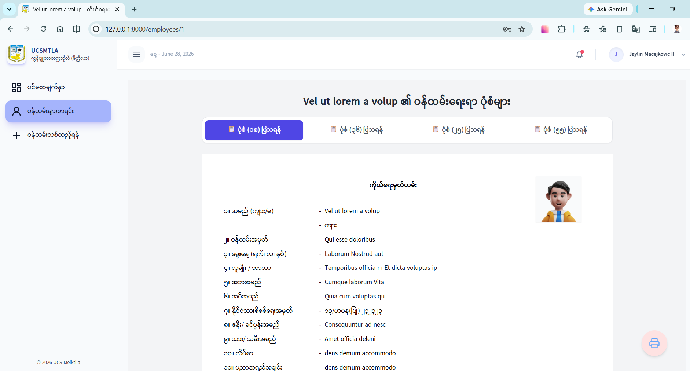
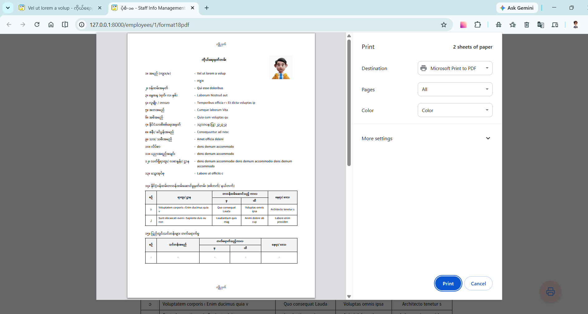
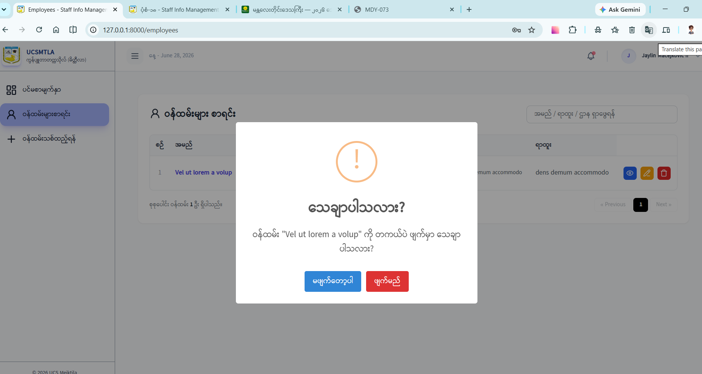

# 📝 Staff Info Management System

A robust, modern Web Application designed to manage and track university staff information, departments, positions, and history records seamlessly. Built with a focus on fast performance, reactive UI, and secure data handling.

---

## 🚀 Key Features

- **Dynamic Staff Profiling:** Efficiently create, read, update, and delete (CRUD) employee profiles, complete with photo attachments, family records, and history tracking.
- **Advanced Multi-keyword Search:** Custom search filter capable of splitting search words by spaces or slashes to dynamically filter by Name, Position, and Department simultaneously.
- **Custom Suggestion Inputs:** Reactive, custom dropdown suggestions for fast data entry (Positions/Departments) that bypass native browser styling bugs on wide/scrollable tables.
- **Intuitive Feedback UI:** Enhanced user actions using SweetAlert2 for elegant confirmation dialogs and center-aligned operational notifications.
- **Responsive Pagination:** Securely paginated backend results sorted chronologically (Created AT Ascending) with persistent query string parameters.

---

## 📷 Screenshots & Visual Walkthrough

### 🖥️ Dashboard & Staff Directory

Features a comprehensive data table with a multi-keyword query filter and optimized pagination.


### ➕ Add New Staff Form

Equipped with clean validation tracking



### Show Staff Form

Equipped with clean tab view



### ⚠️ Elegant Confirmations & Toasts

Utilizes SweetAlert2 for user action feedback and delete safety confirmation blocks.


---

## 🛠️ Tech Stack & Architecture

The application is engineered using a modern decoupled monolithic architecture:

- **Backend Framework:** Laravel (PHP)
- **Frontend Library:** React.js (JavaScript)
- **Monolith Bridge:** Inertia.js (Shared State & Routing)
- **Styling Engine:** Tailwind CSS
- **Icon Library:** Lucide React
- **Dialog Engine:** SweetAlert2
- **Database:** MySQL

---

## ⚙️ Installation & Setup

Follow these steps to spin up the project locally:

### Prerequisites

- PHP >= 8.2
- Composer
- Node.js & npm

### Setup Steps

```bash
# 1. Clone the Project
git clone https://github.com/your-username/staff-info-management.git
cd staff-info-management

# 2. Configure Backend Environment
composer install
cp .env.example .env
php artisan key:generate

DB_CONNECTION=mysql
DB_HOST=127.0.0.1
DB_PORT=3306
DB_DATABASE=staff-mg-db
DB_USERNAME=root
DB_PASSWORD=

# 3. Run Migrations
php artisan migrate --seed
## 3.1 For Storage Link
php artisan storage:link

# 4. Configure Frontend Environment
npm install

## 4.1 Run Frontend Environment
npm run dev

# 5. Start Laravel Server
php artisan serve
```
